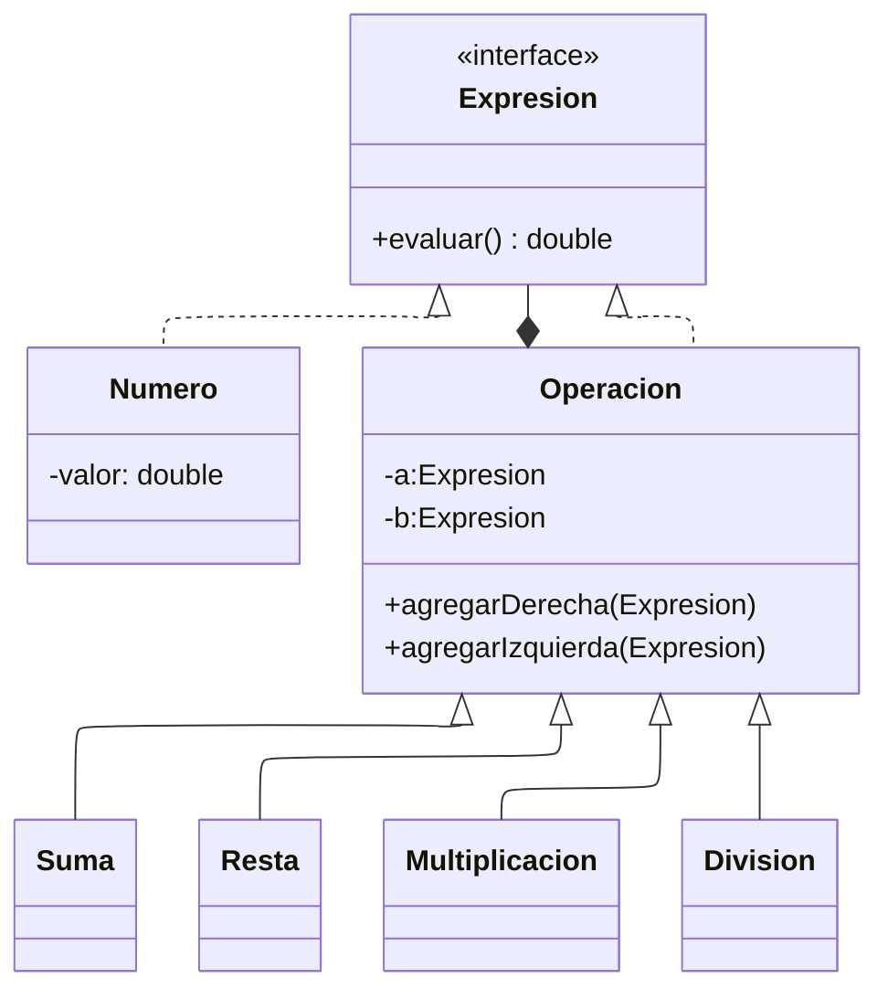

# Ejercicio_composite

Integrantes

- Yhoan Mauricio Bermudez Tique (20242020242)

- Sebastian David Trujillo Vargas (20242020217)

- David Felipe Batanero Molina (20241020092)
  
---

Descripción del Ejercicio

Se una el patron composite para la implementación de la evaluación de una operación aritmética (+, -, *, /) representada en un árbol binario.

---

Diagrama UML

El diagrama de clases que representa el modelo puede visualizarse en la imagen

